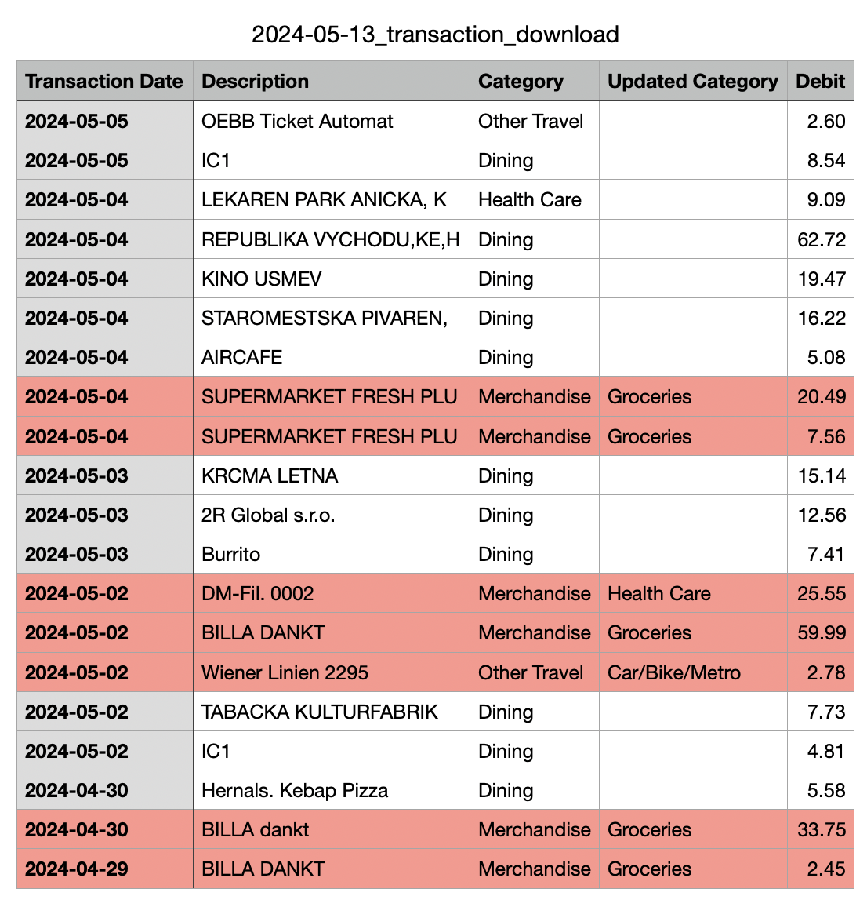

# Accounting

## About

A data pipeline that extracts transactions, categorizes them using an LLM, and stores them on iCloud for analysis.

<figcaption>An example of how Capital One transactions get recategorized.</figcaption>

### Problem

1. As someone who uses checking accounts and credit cards from different countries, I can't easily get an overview of all my spending for any month / year in a single report. Personal finance apps (like [Mint](https://mint.intuit.com/)) don't let you connect foreign bank accounts.
2. Banks and credit cards don't categorize transactions the way I like.
3. Cash transactions go unaccounted for with apps provided by banks.

### Developing a Solution

For the longest time, I used mental math to add transactions from my accounts and tracked the numbers on [Notion](https://www.notion.so). With that process:
- I made mistakes from time-to-time.
- I could never easily create visuals to better understand my spending habits.
- I couldn't easily compare spending year to year.

Since I aimed to get this project up-and-running asap, wanted to keep financial data safe, and didnt want to invest time into building a UI, this app:
- Stores categorized businesses in `categorized_businesses.csv`, leverages [OpenAI](https://platform.openai.com/docs/introduction) to categorize new businesses, and falls back on user input when unsure.
- Stores all past transactions in an iCloud folder so that it's all backed up. 
- Uses a [Notion Integration](https://www.notion.so/integrations) so that my wife and I can continue tracking cash transactions on Notion.
- Analyzes transaction history in the Jupyter Notebook `analysis.ipynb`.

## Support
- Capital One transactions

## Setup
1. Create a virtual environment: `python -m venv accoutningenv`
2. (VSCode) Install ipykernal: `pip install ipykernel`
3. Create a Jupyter Kernal: `python -m ipykernel install --user --name=accoutningenv` 

## How to run
1. Activate environment: `source accountingenv/bin/activate`
2. Install dependencies: `pip install -r requirements.txt`
3. Place downloaded transactions in `data/temp/`
3. Run `python import_latest_transactions.py`

## Extra commands
- Deactivate environment: `deactivate`
- Display installed packages: `pip list`
- Capture current dependencies: `pip freeze > requirements.txt`
- Run a module `python -m accounting.credit_card_transactions_pipeline`

## To-dos
1. Add support for inputting cash transactions on Notion
2. Create unit tests to ensure program works as expected
3. Add support for Citi Card
4. Add support for cash transactions